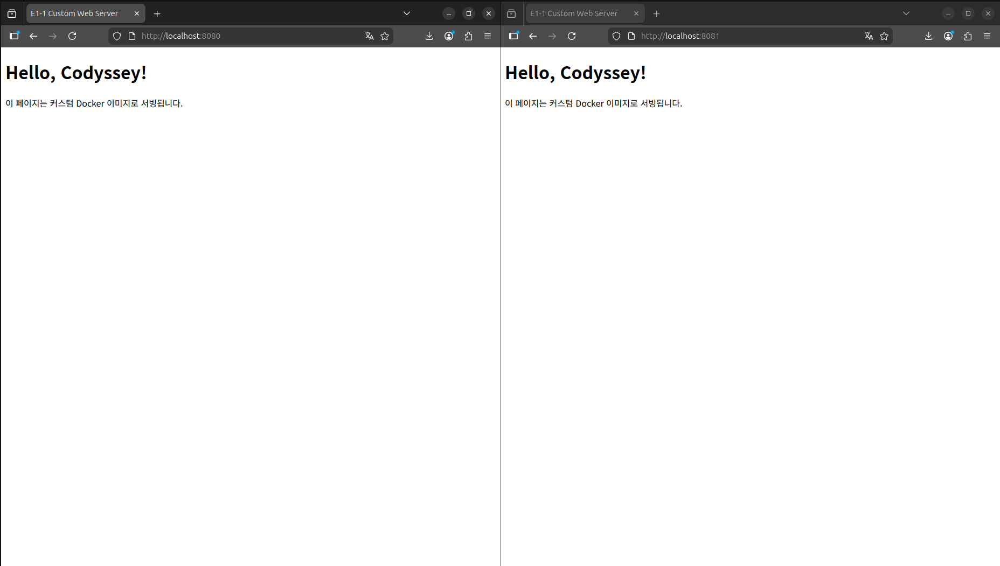

# E1-1 개발 워크스테이션 구축

## 1. 프로젝트 개요
## 2. 실행 환경

```bash
$ uname -a
Linux nansu0425-VMware-Virtual-Platform 6.17.0-19-generic #19~24.04.2-Ubuntu SMP PREEMPT_DYNAMIC Fri Mar  6 23:08:46 UTC 2 x86_64 x86_64 x86_64 GNU/Linux

$ cat /etc/os-release
PRETTY_NAME="Ubuntu 24.04.4 LTS"
NAME="Ubuntu"
VERSION_ID="24.04"
VERSION="24.04.4 LTS (Noble Numbat)"
VERSION_CODENAME=noble
ID=ubuntu
ID_LIKE=debian
HOME_URL="https://www.ubuntu.com/"
SUPPORT_URL="https://help.ubuntu.com/"
BUG_REPORT_URL="https://bugs.launchpad.net/ubuntu/"
PRIVACY_POLICY_URL="https://www.ubuntu.com/legal/terms-and-policies/privacy-policy"
UBUNTU_CODENAME=noble
LOGO=ubuntu-logo

$ echo $SHELL
/bin/bash

$ git --version
git version 2.43.0

$ docker --version
Docker version 28.2.2, build 28.2.2-0ubuntu1~24.04.1
```

## 3. 수행 항목 체크리스트
## 4. 터미널 조작 로그

```bash
# 현재 위치 확인
$ pwd
/home/nansu0425/Documents/projects/E1-1

# 목록 확인 (숨김 파일 포함)
$ ls -la
total 44
drwxrwxr-x 7 nansu0425 nansu0425 4096 Mar 31 15:14 .
drwxrwxr-x 3 nansu0425 nansu0425 4096 Mar 31 07:33 ..
drwxrwxr-x 2 nansu0425 nansu0425 4096 Mar 31 08:08 app
drwxrwxr-x 2 nansu0425 nansu0425 4096 Mar 31 07:59 .claude
-rw-rw-r-- 1 nansu0425 nansu0425 6176 Mar 31 15:14 CLAUDE.md
drwxrwxr-x 2 nansu0425 nansu0425 4096 Mar 31 07:35 docs
drwxrwxr-x 8 nansu0425 nansu0425 4096 Mar 31 15:18 .git
-rw-rw-r-- 1 nansu0425 nansu0425   45 Mar 31 08:08 .gitignore
-rw-rw-r-- 1 nansu0425 nansu0425 2703 Mar 31 14:49 README.md
drwxrwxr-x 2 nansu0425 nansu0425 4096 Mar 31 14:24 screenshots

# 실습용 디렉토리 생성
$ mkdir -p practice/subdir

# 디렉토리 이동
$ cd practice
$ pwd
/home/nansu0425/Documents/projects/E1-1/practice

$ cd ..
$ pwd
/home/nansu0425/Documents/projects/E1-1

# 빈 파일 생성
$ touch practice/empty.txt

# 내용이 있는 파일 생성
$ echo "Hello, Codyssey!" > practice/hello.txt

# 파일 내용 확인
$ cat practice/hello.txt
Hello, Codyssey!

# 파일 복사
$ cp practice/hello.txt practice/hello_backup.txt

# 파일 이동 (이름 변경)
$ mv practice/hello_backup.txt practice/subdir/renamed.txt

# 디렉토리 목록으로 확인
$ ls -la practice/
total 16
drwxrwxr-x 3 nansu0425 nansu0425 4096 Mar 31 15:23 .
drwxrwxr-x 8 nansu0425 nansu0425 4096 Mar 31 15:22 ..
-rw-rw-r-- 1 nansu0425 nansu0425    0 Mar 31 15:23 empty.txt
-rw-rw-r-- 1 nansu0425 nansu0425   17 Mar 31 15:23 hello.txt
drwxrwxr-x 2 nansu0425 nansu0425 4096 Mar 31 15:23 subdir

$ ls -la practice/subdir/
total 12
drwxrwxr-x 2 nansu0425 nansu0425 4096 Mar 31 15:23 .
drwxrwxr-x 3 nansu0425 nansu0425 4096 Mar 31 15:23 ..
-rw-rw-r-- 1 nansu0425 nansu0425   17 Mar 31 15:23 renamed.txt

# 파일 삭제
$ rm practice/subdir/renamed.txt

# 디렉토리 삭제
$ rm -r practice/subdir

# 최종 상태 확인
$ ls -la practice/
total 12
drwxrwxr-x 2 nansu0425 nansu0425 4096 Mar 31 15:23 .
drwxrwxr-x 8 nansu0425 nansu0425 4096 Mar 31 15:22 ..
-rw-rw-r-- 1 nansu0425 nansu0425    0 Mar 31 15:23 empty.txt
-rw-rw-r-- 1 nansu0425 nansu0425   17 Mar 31 15:23 hello.txt
```
## 5. 권한 실습

### 파일 권한 변경

**변경 전:**

```bash
$ echo "permission test" > practice/perm_test.txt
$ ls -l practice/perm_test.txt
-rw-rw-r-- 1 nansu0425 nansu0425 16 Mar 31 15:31 practice/perm_test.txt
```

**변경 후 (chmod 755):**

```bash
$ chmod 755 practice/perm_test.txt
$ ls -l practice/perm_test.txt
-rwxr-xr-x 1 nansu0425 nansu0425 16 Mar 31 15:31 practice/perm_test.txt
```

### 디렉토리 권한 변경

**변경 전:**

```bash
$ mkdir practice/perm_dir
$ ls -ld practice/perm_dir
drwxrwxr-x 2 nansu0425 nansu0425 4096 Mar 31 15:32 practice/perm_dir
```

**변경 후 (chmod 700):**

```bash
$ chmod 700 practice/perm_dir
$ ls -ld practice/perm_dir
drwx------ 2 nansu0425 nansu0425 4096 Mar 31 15:32 practice/perm_dir
```

### 권한 숫자 설명

| 권한 | 숫자 | 의미 |
|------|------|------|
| `rw-rw-r--` | 664 | 소유자/그룹: 읽기+쓰기, 기타: 읽기만 (Ubuntu 기본 파일 권한) |
| `rwxr-xr-x` | 755 | 소유자: 모든 권한, 그룹/기타: 읽기+실행 (실행 파일, 디렉토리 기본값) |
| `rwx------` | 700 | 소유자만 모든 권한, 그룹/기타: 접근 불가 (비공개 디렉토리) |

- 각 자리는 읽기(r=4), 쓰기(w=2), 실행(x=1)의 합으로 표현
- 세 자리 숫자는 순서대로 소유자(owner), 그룹(group), 기타(others)의 권한을 나타냄

## 6. Docker 설치 및 기본 점검

### Docker 버전 확인

```bash
$ docker --version
Docker version 28.2.2, build 28.2.2-0ubuntu1~24.04.1
```

### Docker 데몬 상태 확인

```bash
$ docker info
Server Version: 28.2.2
Storage Driver: overlay2
 Backing Filesystem: extfs
Operating System: Ubuntu 24.04.4 LTS
Kernel Version: 6.17.0-19-generic
Architecture: x86_64
CPUs: 4
Total Memory: 7.709GiB
Docker Root Dir: /var/lib/docker
Default Runtime: runc
```

## 7. Docker 기본 운영

### 이미지 목록 확인

```bash
$ docker images
REPOSITORY    TAG       IMAGE ID       CREATED      SIZE
hello-world   latest    e2ac70e7319a   7 days ago   10.1kB
```

### 컨테이너 목록 확인

```bash
# 실행 중인 컨테이너
$ docker ps
CONTAINER ID   IMAGE     COMMAND   CREATED   STATUS    PORTS     NAMES

# 전체 컨테이너 (종료된 것 포함)
$ docker ps -a
CONTAINER ID   IMAGE         COMMAND    CREATED          STATUS                      PORTS     NAMES
014e4d3b9c69   hello-world   "/hello"   19 seconds ago   Exited (0) 18 seconds ago             kind_greider
```

### 컨테이너 로그 확인

```bash
$ docker logs my-ubuntu
bin
boot
dev
etc
home
lib
lib64
media
mnt
opt
proc
root
run
sbin
srv
sys
tmp
usr
var
Hello from container!
```

### 컨테이너 리소스 확인

```bash
$ docker run -d --name stats-test ubuntu sleep 60
2b4ab49c30229993f3d5d35b39a15719aa280dc171b799027c2db9729a78bc1a

$ docker stats --no-stream
CONTAINER ID   NAME         CPU %     MEM USAGE / LIMIT   MEM %     NET I/O         BLOCK I/O   PIDS
2b4ab49c3022   stats-test   0.00%     448KiB / 7.709GiB   0.01%     2.76kB / 126B   0B / 0B     1
```

## 8. 컨테이너 실행 실습

### hello-world 실행

```bash
$ docker run hello-world
Unable to find image 'hello-world:latest' locally
latest: Pulling from library/hello-world
4f55086f7dd0: Pull complete
Digest: sha256:452a468a4bf985040037cb6d5392410206e47db9bf5b7278d281f94d1c2d0931
Status: Downloaded newer image for hello-world:latest

Hello from Docker!
This message shows that your installation appears to be working correctly.

To generate this message, Docker took the following steps:
 1. The Docker client contacted the Docker daemon.
 2. The Docker daemon pulled the "hello-world" image from the Docker Hub.
    (amd64)
 3. The Docker daemon created a new container from that image which runs the
    executable that produces the output you are currently reading.
 4. The Docker daemon streamed that output to the Docker client, which sent it
    to your terminal.

To try something more ambitious, you can run an Ubuntu container with:
 $ docker run -it ubuntu bash

Share images, automate workflows, and more with a free Docker ID:
 https://hub.docker.com/

For more examples and ideas, visit:
 https://docs.docker.com/get-started/
```

### ubuntu 컨테이너 실행

```bash
$ docker pull ubuntu
Using default tag: latest
latest: Pulling from library/ubuntu
817807f3c64e: Pull complete
Digest: sha256:186072bba1b2f436cbb91ef2567abca677337cfc786c86e107d25b7072feef0c
Status: Downloaded newer image for ubuntu:latest

$ docker run -it --name my-ubuntu ubuntu bash
# ls
bin  boot  dev  etc  home  lib  lib64  media  mnt  opt  proc  root  run  sbin  srv  sys  tmp  usr  var
# echo "Hello from container!"
Hello from container!
# exit
```

### attach와 exec 차이

```bash
# 백그라운드로 ubuntu 컨테이너 실행
$ docker run -dit --name attach-test ubuntu bash

# attach: 메인 프로세스(PID 1)에 연결
$ docker attach attach-test
# exit
# → 컨테이너 종료됨

$ docker ps -a --filter name=attach-test
CONTAINER ID   IMAGE    COMMAND   CREATED   STATUS                     NAMES
1d43054c5e74   ubuntu   "bash"    ...       Exited (137) 1 second ago  attach-test

# 컨테이너 재시작
$ docker start attach-test

# exec: 새 프로세스로 진입
$ docker exec -it attach-test bash
# echo "exec test"
exec test
# exit
# → 컨테이너 계속 실행 중

$ docker ps --filter name=attach-test
CONTAINER ID   IMAGE    COMMAND   CREATED   STATUS         NAMES
1d43054c5e74   ubuntu   "bash"    ...       Up 4 seconds   attach-test
```

**attach와 exec의 차이점:**

- `docker attach`: 컨테이너의 메인 프로세스(PID 1)에 직접 연결된다. `exit`으로 나가면 메인 프로세스가 종료되므로 컨테이너도 함께 종료된다.
- `docker exec`: 컨테이너 안에 새로운 프로세스를 생성하여 진입한다. `exit`으로 나가면 해당 프로세스만 종료되고, 메인 프로세스(PID 1)는 영향을 받지 않으므로 컨테이너는 계속 실행된다.

### 실습 컨테이너 정리

```bash
$ docker rm -f my-ubuntu stats-test attach-test
my-ubuntu
stats-test
attach-test

$ docker ps -a
CONTAINER ID   IMAGE     COMMAND   CREATED   STATUS    PORTS     NAMES
```
## 9. Dockerfile 커스텀 이미지

### 베이스 이미지 선택 이유

`nginx:alpine`을 선택했다. Nginx는 정적 파일 서빙에 최적화된 웹 서버이고, Alpine 리눅스 기반이라 이미지 크기가 약 62MB로 경량이다. 별도의 설정 없이 HTML 파일만 복사하면 바로 웹 서버로 동작한다.

### 커스텀 포인트

| 항목 | 목적 |
|------|------|
| `LABEL` | 이미지 메타데이터 (관리자, 설명) |
| `ENV APP_ENV=dev` | 환경 변수로 실행 모드 구분 |
| `COPY app/` | 커스텀 정적 콘텐츠 배포 |
| `EXPOSE 80` | 컨테이너가 사용하는 포트 문서화 |
| `HEALTHCHECK` | 컨테이너 상태 자동 점검 (30초 간격, 3초 타임아웃) |

### 이미지 빌드

```bash
$ docker build -t my-web:1.0 .
Sending build context to Docker daemon  349.2kB
Step 1/7 : FROM nginx:alpine
alpine: Pulling from library/nginx
Status: Downloaded newer image for nginx:alpine
 ---> d5030d429039
Step 2/7 : LABEL maintainer="nansu0425"
Step 3/7 : LABEL description="E1-1 커스텀 Nginx 웹 서버"
Step 4/7 : ENV APP_ENV=dev
Step 5/7 : COPY app/ /usr/share/nginx/html/
Step 6/7 : EXPOSE 80
Step 7/7 : HEALTHCHECK --interval=30s --timeout=3s   CMD wget -qO- http://localhost/ || exit 1
Successfully built 526c448f9a74
Successfully tagged my-web:1.0
```

### 빌드된 이미지 확인

```bash
$ docker images | grep my-web
my-web        1.0       526c448f9a74   62.2MB
```

### 컨테이너 실행 및 동작 확인

```bash
$ docker run -d --name my-web-test -p 8080:80 my-web:1.0

$ wget -qO- http://localhost:8080
<!DOCTYPE html>
<html lang="ko">
<head>
    <meta charset="UTF-8">
    <title>E1-1 Custom Web Server</title>
</head>
<body>
    <h1>Hello, Codyssey!</h1>
    <p>이 페이지는 커스텀 Docker 이미지로 서빙됩니다.</p>
</body>
</html>
```

### 테스트 컨테이너 정리

```bash
$ docker rm -f my-web-test
my-web-test
```

이미지(`my-web:1.0`)는 Phase 5에서 사용하므로 유지한다.

## 10. 포트 매핑 접속 증거

### 동시 실행 (포트 8080, 8081)

```bash
$ docker run -d -p 8080:80 --name my-web-8080 my-web:1.0
45c370906218f40e9f7a039951c43f809d107a68b450a347d387c8010a59f62b

$ docker run -d -p 8081:80 --name my-web-8081 my-web:1.0
a83b0d039e1ab4f333a5a8eba22ecbab2e71c125e8c4bfe711e1c265a6483abb

$ docker ps --filter "name=my-web-808"
CONTAINER ID   IMAGE        COMMAND                  CREATED         STATUS                            PORTS                                     NAMES
a83b0d039e1a   my-web:1.0   "/docker-entrypoint.…"   7 seconds ago   Up 6 seconds (health: starting)   0.0.0.0:8081->80/tcp, [::]:8081->80/tcp   my-web-8081
45c370906218   my-web:1.0   "/docker-entrypoint.…"   8 seconds ago   Up 7 seconds (health: starting)   0.0.0.0:8080->80/tcp, [::]:8080->80/tcp   my-web-8080
```

`-p 호스트포트:컨테이너포트` 옵션으로 하나의 이미지를 서로 다른 포트에 동시 실행할 수 있다.

### wget 응답 확인

```bash
$ wget -qO- http://localhost:8080
<!DOCTYPE html>
<html lang="ko">
<head>
    <meta charset="UTF-8">
    <title>E1-1 Custom Web Server</title>
</head>
<body>
    <h1>Hello, Codyssey!</h1>
    <p>이 페이지는 커스텀 Docker 이미지로 서빙됩니다.</p>
</body>
</html>

$ wget -qO- http://localhost:8081
<!DOCTYPE html>
<html lang="ko">
<head>
    <meta charset="UTF-8">
    <title>E1-1 Custom Web Server</title>
</head>
<body>
    <h1>Hello, Codyssey!</h1>
    <p>이 페이지는 커스텀 Docker 이미지로 서빙됩니다.</p>
</body>
</html>
```

### 브라우저 접속 스크린샷



### 정리

```bash
$ docker rm -f my-web-8080 my-web-8081
my-web-8080
my-web-8081
```

## 11. 바인드 마운트 및 볼륨 영속성

### 바인드 마운트

호스트의 `app/` 디렉토리를 컨테이너의 웹 루트에 마운트하여 파일 변경이 즉시 반영되는지 확인한다.

```bash
$ docker run -d -p 8082:80 --name bind-test \
  -v "$(pwd)/app:/usr/share/nginx/html" my-web:1.0
8d60a938f19a658a532200158aa892b852b01eb35c563c211552042639e7510c
```

**변경 전:**

```bash
$ wget -qO- http://localhost:8082
<!DOCTYPE html>
<html lang="ko">
<head>
    <meta charset="UTF-8">
    <title>E1-1 Custom Web Server</title>
</head>
<body>
    <h1>Hello, Codyssey!</h1>
    <p>이 페이지는 커스텀 Docker 이미지로 서빙됩니다.</p>
</body>
</html>
```

**호스트에서 파일 수정:**

```bash
$ echo '<h1>Updated Content!</h1>' > app/index.html
```

**변경 후:**

```bash
$ wget -qO- http://localhost:8082
<h1>Updated Content\!</h1>
```

호스트에서 파일을 수정하면 컨테이너에 즉시 반영된다. 바인드 마운트는 호스트와 컨테이너가 동일한 파일시스템을 공유하기 때문이다.

**원본 복원 및 정리:**

```bash
# app/index.html을 원래 내용으로 복원
$ docker rm -f bind-test
bind-test
```

### 볼륨 영속성

Docker 볼륨은 컨테이너가 삭제되어도 데이터가 유지되는지 검증한다.

```bash
# 볼륨 생성
$ docker volume create mydata
mydata

# 1단계: 볼륨에 데이터 쓰기
$ docker run -d --name vol-test -v mydata:/data ubuntu sleep infinity
f0aaa075f00def3259dbc014cfc2985c4e6579479785a398e949f641bcbe9af3

$ docker exec vol-test bash -c "echo 'persistent data' > /data/hello.txt"
$ docker exec vol-test cat /data/hello.txt
persistent data

# 2단계: 컨테이너 삭제
$ docker rm -f vol-test
vol-test

# 3단계: 새 컨테이너에 같은 볼륨 연결 → 데이터 확인
$ docker run -d --name vol-test2 -v mydata:/data ubuntu sleep infinity
ca295aa5992b72aa6a9da46d339fe4015b7177cdd76220eca5cc0b417fe46e4f

$ docker exec vol-test2 cat /data/hello.txt
persistent data
```

컨테이너를 삭제해도 볼륨의 데이터는 유지된다. Docker 볼륨은 컨테이너 생명주기와 독립적으로 관리되기 때문이다.

```bash
# 정리
$ docker rm -f vol-test2
vol-test2

$ docker volume rm mydata
mydata
```
## 12. Git 설정 및 GitHub 연동

### Git 설정 확인

```bash
$ git config --list
user.name=nansu0425
user.email=nansu0425@gmail.com
init.defaultbranch=main
core.repositoryformatversion=0
core.filemode=true
core.bare=false
core.logallrefupdates=true
remote.origin.url=https://github.com/nansu0425/E1-1.git
remote.origin.fetch=+refs/heads/*:refs/remotes/origin/*
branch.main.remote=origin
branch.main.merge=refs/heads/main
```

### GitHub 연동


### GitHub SSH 키 설정 (보너스)

```bash
$ ssh-keygen -t ed25519 -C "nansu0425@gmail.com"
Generating public/private ed25519 key pair.
Enter file in which to save the key (/home/nansu0425/.ssh/id_ed25519):
Enter passphrase (empty for no passphrase):
Enter same passphrase again:
Your identification has been saved in /home/nansu0425/.ssh/id_ed25519
Your public key has been saved in /home/nansu0425/.ssh/id_ed25519.pub
The key fingerprint is:
SHA256:oAKk1kPhHsVFAA7FyPT5e20x+74x/jcYV3Fx5VyAK8Y nansu0425@gmail.com

$ cat ~/.ssh/id_ed25519.pub
ssh-ed25519 AAAAC3NzaC1lZDI1NTE5AAAAICfkXP201tQWcUnQA6DviZRSCEYHM9qd2ZnrdB9Y0zZ3 nansu0425@gmail.com

$ ssh -T git@github.com
Hi nansu0425! You've successfully authenticated, but GitHub does not provide shell access.

$ git remote set-url origin git@github.com:nansu0425/E1-1.git

$ git remote -v
origin	git@github.com:nansu0425/E1-1.git (fetch)
origin	git@github.com:nansu0425/E1-1.git (push)

$ git push origin main
To github.com:nansu0425/E1-1.git
   5010658..df4841f  main -> main
```

## 13. 트러블슈팅
