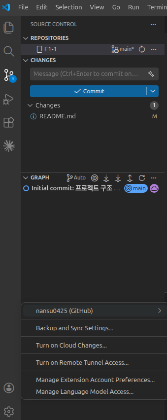

# Git 설정 및 GitHub 연동

Git 사용자 정보 설정, GitHub 저장소 연동, SSH 키 설정을 기록한 문서이다.

## Git 설정 확인

```bash
$ git config --list
user.name=nansu0425
user.email=nansu0425@gmail.com
init.defaultbranch=main
core.repositoryformatversion=0
core.filemode=true
core.bare=false
core.logallrefupdates=true
remote.origin.url=git@github.com:nansu0425/E1-1.git
remote.origin.fetch=+refs/heads/*:refs/remotes/origin/*
branch.main.remote=origin
branch.main.merge=refs/heads/main
```

## GitHub 연동



## GitHub SSH 키 설정 (보너스)

```bash
$ ssh-keygen -t ed25519 -C "nansu0425@gmail.com"
Generating public/private ed25519 key pair.
Enter file in which to save the key (/home/nansu0425/.ssh/id_ed25519):
Enter passphrase (empty for no passphrase):
Enter same passphrase again:
Your identification has been saved in /home/nansu0425/.ssh/id_ed25519
Your public key has been saved in /home/nansu0425/.ssh/id_ed25519.pub
The key fingerprint is:
SHA256:oAKk1kPhHsVFAA7FyPT5e20x+74x/jcYV3Fx5VyAK8Y nansu0425@gmail.com

$ cat ~/.ssh/id_ed25519.pub
ssh-ed25519 AAAA****<마스킹> nansu0425@gmail.com

$ ssh -T git@github.com
Hi nansu0425! You've successfully authenticated, but GitHub does not provide shell access.

$ git remote set-url origin git@github.com:nansu0425/E1-1.git

$ git remote -v
origin	git@github.com:nansu0425/E1-1.git (fetch)
origin	git@github.com:nansu0425/E1-1.git (push)

$ git push origin main
To github.com:nansu0425/E1-1.git
   5010658..df4841f  main -> main
```
